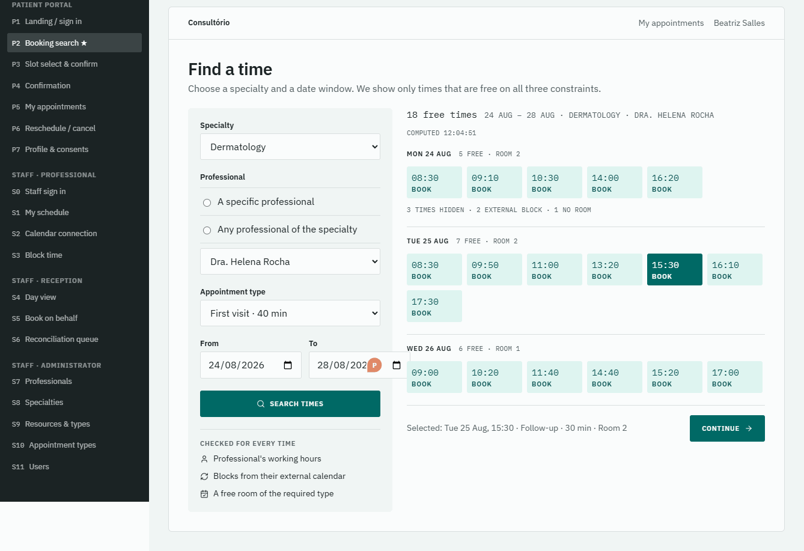
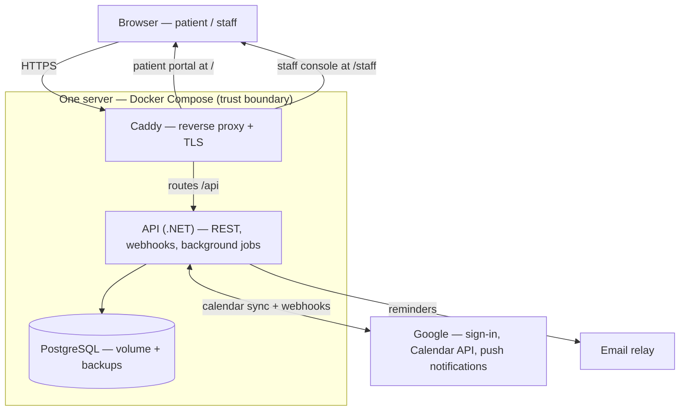

# Consult Rio — clinic scheduling

**A scheduling system for clinics where appointments, professionals and rooms all have to line up
at the same time.**

*A portfolio project, built in ten reviewed increments. Seven are built and running; three remain.
The order is deliberate — infrastructure first, then identity, then the domain — and every
increment leaves the system working end to end.*

---

## The problem

Clinics with several professionals and shared resources — consulting rooms, equipment — lose money
and time to scheduling done by hand. Three failures cause most of it:

- **Double-booking.** Two patients for the same doctor, or two doctors for the same room. Someone
  arrives and has to be turned away.
- **No-shows.** An appointment nobody was reminded about is an empty slot that could have gone to
  someone else.
- **Calendar drift.** A doctor blocks a personal commitment in their own Google Calendar. The front
  desk cannot see it, books a patient into that slot, and the clinic finds out on the day.

## What makes it hard

An appointment can only exist if **three things are free at the same moment**:

| | must be |
|---|---|
| **The patient** | not already booked elsewhere |
| **The professional** | inside their working hours, holding the right specialty, and not blocked — *including blocks they made in their own Google Calendar* |
| **A room or equipment** | of the type this appointment needs, and free |

Miss any one and you get a booking that cannot actually happen. Checking all three, in real time,
against a calendar the clinic does not own, is the interesting part of this project — a
constraint-satisfaction problem rather than a form that saves a row.

The second hard part is what happens when the outside world disagrees with you: the doctor blocks a
slot that already has a patient in it. The system detects the collision and **hands it to a human**
with the context to decide, because cancelling someone's appointment is a business decision, not
something a job should do silently at 3am.



*Design for the booking screen — the target for increment 5, now built. Note the panel on the
right: for every time offered, the system has already checked the professional's working hours,
blocks from their external calendar, and a free room of the required type. What runs today is
below.*

## What works today

Everything marked **running** works behind the checks described further down. Nothing else is
claimed.

| # | Increment | State | What a person can do |
|---|---|---|---|
| 1 | Walking skeleton | **running** | The whole stack comes up with one command: reverse proxy, API, database. Both web surfaces are served from a single origin, and the system reports its own health including database connectivity. |
| 2 | Identity & session | **running** | An administrator signs in, is required to replace the bootstrap password before doing anything else, and creates staff accounts. A patient signs in with Google, and can see and correct their own data and consents — and nobody else's. Someone the clinic has not registered is turned away at the staff sign-in and told to ask administration, rather than quietly becoming a patient. Every screen is in Portuguese and English. |
| 3a | Clinic catalog | **running** | An administrator defines what the clinic offers: specialties, rooms and equipment, and the kinds of visit that need them. A specialty still in use cannot be retired, and the refusal says how much is in the way. |
| 3b | Professional configuration | **running** | What each professional does and when: their specialties, how long each kind of visit takes them, and their working hours. A duration can only be set for something they are qualified to do, and revoking a qualification something depends on is refused. |
| 4 | Availability | **running** | Free times computed for a date range: working hours minus days off, converted against the clinic's timezone, cut into slots as long as that professional takes, minus the periods they have blocked. A professional blocks their own time on their own screen. The patient and room halves of the three-way check arrive with the appointments they need — increment 5. |
| 5 | Booking | **running** | A patient searches real availability and books: only genuinely free times, then a confirmation. Two people cannot take the same slot, the same room, or double-book themselves — the database refuses it, not the code. A professional can no longer block time over an appointment they already have. A patient can also see their own appointments and move or cancel one, up to a day before it starts — after that the screen says to call reception, rather than offering a button that fails — and reception can. The staff console now runs the day: a professional sees their own schedule, reception sees every professional's with the room shown, books a walk-in for an existing patient, and cancels or moves an appointment the patient is no longer allowed to change. |
| 6a | Calendar — connection | **running** | A professional connects their own Google Calendar from the staff console, separately from signing in, and the screen tells them the truth about it — including when it last checked, and what to do when the permission has been withdrawn at Google. They can withdraw it here too, which also hands the grant back to Google. The credential this produces is the first thing in the system encrypted at rest. |
| 6b | Calendar — outbound | not yet built | A booked appointment appears in the professional's Google Calendar, reliably, even if Google is briefly unreachable. |
| 7 | Calendar — inbound | not yet built | A block made in Google Calendar becomes unavailability here, and collisions are queued for a human. |
| 8 | Reminders | not yet built | A reminder email before the appointment. |

The first two were the least glamorous and the most load-bearing: a deployment shaped
like production rather than like a demo, a domain boundary the compiler enforces, tests that run
against a real database, a third test tier that goes through the real reverse proxy, two different
ways of signing in that produce one revocable session, permission checks at two levels (what your
role may do, *and* whether this particular record is yours), and an audit trail of staff access to
patient data.

---

## Try it locally

You need **Docker Desktop** (with Compose v2). That is all — you do not need .NET or Node installed
to run it.

```bash
cp .env.example .env

# from the repository root:
docker compose --env-file .env -f infra/docker-compose.yml up --build
```

`--env-file .env` is not optional. Compose looks for a bare `.env` next to the compose file
(`infra/`), not in the directory you are standing in, so without the flag every setting silently
comes out empty.

If you already had a `.env` from an earlier version, add one line to it — the API now refuses to
start without knowing which timezone the clinic runs in, rather than guessing:

```
Clinic__Timezone=America/Sao_Paulo
```

**Connecting a Google Calendar is optional and off by default.** Leave `Calendar__RedirectUri`
empty and everything else runs exactly as before. To turn it on, follow
[docs/08-google-setup.md](docs/08-google-setup.md) — it adds two clicks in the Google Console and
one generated key:

```
Calendar__RedirectUri=http://localhost:8080/api/calendar/connect/callback
Calendar__TokenEncryptionKey=
```

The key is one you generate — `openssl rand -base64 32` prints it, and the output goes in as the
value. [docs/08-google-setup.md](docs/08-google-setup.md) has the alternatives if you have no
`openssl`.

That key protects a professional's Google credential in the database, so it has to survive
redeploys — the API refuses to start if the feature is on and the key is missing, rather than
storing the credential in clear.

**The first build takes several minutes** — it compiles the API and both web apps from source, then
waits up to 30 seconds for database migrations on first boot. It has not hung.

Then open:

| | |
|---|---|
| **http://localhost:8080/** | the patient portal |
| **http://localhost:8080/staff/** | the staff console |
| **http://localhost:8080/api/health** | a plain health report, handy for "is it actually up?" |

Only the proxy is reachable from your machine; the API and the database sit on an internal network,
which is the same shape this runs in on a real server.

### Signing in, and the wall you will hit

Go to **http://localhost:8080/staff/** and sign in with the credentials from `.env`:

```
admin@clinic.local  /  change-me-on-first-sign-in
```

**Every other request will now be refused** until you set a new password of at least 12 characters.
That is intentional, and it is the feature: an administrator account still using the password that
was written in a config file is a hole, so the API refuses to let that credential linger. Change it
and the console opens up.

**Sign in with Google is optional.** Without a Google client configured, that button reports that it
is unavailable and everything else keeps working. To turn it on, follow
[docs/08-google-setup.md](docs/08-google-setup.md) — it takes about five minutes and needs no
tunnel, because Google permits plain HTTP for `localhost`.

When you are done:

```bash
docker compose --env-file .env -f infra/docker-compose.yml down -v
```

The `-v` also deletes the database volume, so you start clean next time.

*Last verified end-to-end on 2026-08-21, at commit `138db7a`.*

### Working on the code

Then you also need the pinned toolchain: **.NET SDK 10.0.400** (see `global.json`), **Node 22**, and
**pnpm** via `corepack enable`.

```bash
pnpm install
pnpm dev:portal   # http://localhost:5173
pnpm dev:staff    # http://localhost:5174/staff/  (mind the /staff/ — it is served under a prefix)
```

Both dev servers proxy `/api` to `http://localhost:8080`, so **keep the Compose stack running** for
anything that talks to the API.

## Running the checks

```bash
dotnet test apps/api/tests/Domain.UnitTests/Domain.UnitTests.csproj        # the business rules
dotnet test apps/api/tests/Api.IntegrationTests/Api.IntegrationTests.csproj # the API, on a real database
pnpm check:i18n                                                            # no untranslated strings
pnpm check:readme                                                          # this file points at real paths
pnpm smoke                                                                 # the whole stack, through the proxy
```

Three tiers, and the third is the interesting one. The unit tests cover rules that need no database.
The integration tests start a **real PostgreSQL 17** in a container (so Docker must be running) —
the same version the deployment uses, because a test against a substitute proves less. The smoke
tier then asserts what an in-process test structurally cannot see: that the proxy routes correctly,
that deep links survive a page reload, that a session cookie survives crossing the proxy, and that
the styling actually made it into the built files.

Two warnings about `pnpm smoke`: it **deletes the database volume** when it finishes, and
`pnpm smoke --no-manage` (which runs against a stack you already have up) expects an untouched
bootstrap administrator, so it fails once you have changed that password.

Every one of these runs in CI on every push, in this order: spec validation → translations → this
README's links → build both ecosystems → unit → integration → the smoke tier. Cheap checks first,
so a broken spec or a missing translation fails in seconds rather than after two Docker tiers. In
the words of the pipeline's own comment: *CI enforces the definition of done instead of trusting it.*

---

## Decisions, and why

The guiding rule for the whole project: **put architecture where the complexity is, not uniformly.**
Every technology has to answer "what problem does it solve *here*?" — and knowing when *not* to add
a tool is treated as a first-class decision.

These are all decided and written down, with the rejected alternatives beside them. Rows tagged with
an increment number are **decided but not yet built** — the reasoning exists, the code comes with
that increment.

| Decision | Why, and what it costs |
|---|---|
| **Vertical slices with a protected core** | Each feature owns its endpoint, handler and validation; the genuinely hard rules live in one small domain project. That project references no database, no web framework, nothing. The *compiler* enforces it — a build target fails on a forbidden package, and a test inspects the compiled assembly's references to catch infrastructure sneaking in indirectly. Honest cost: slices can duplicate each other without discipline. |
| **Two data-access tools on purpose** | An ORM for writes, where correctness matters and the aggregate enforces invariants. Hand-written SQL for exactly the two things the ORM cannot express: the per-professional lock that makes the cross-table check race-safe, and the time-range overlap query behind availability. Cost: two things to know, and SQL that can drift from the schema — which is why integration tests run against a real database. |
| **Double-booking prevented by the database** | Three time-range exclusion constraints in PostgreSQL — one each for the professional, the room and the patient — not an application check. Two simultaneous bookings for the same slot cannot both succeed, regardless of what the code does; there is a test that writes a colliding appointment straight past the application to prove it. Application checks give the *nice error message*; the constraint is what makes the guarantee true. |
| **A session in a table, not a self-contained token** | The cookie holds a meaningless identifier; the row is the authority. Signing out, disabling an account, or being locked out takes effect on the **very next request** rather than whenever a token happens to expire. Cost: one indexed database read per request, accepted deliberately. |
| **Two levels of permission** | What your role may *do*, and separately whether this particular record is *yours*. A patient reading another patient's file is refused even though patients may read files. The second check is the one most systems forget. |
| **The outbox pattern for calendar sync** *(increment 6)* | There is no shared transaction between our database and Google, so "save the appointment, then create the event" has a window where one succeeds and the other does not. Instead the intent is written in the same transaction as the appointment, and a background job delivers it with retries. Why it matters in product terms: a silently failed sync means the doctor's calendar does not show the appointment, so they book something over it — precisely the failure this product exists to prevent. |
| **Webhooks, plus a sweep that assumes they were missed** *(increment 7)* | Push notifications are fast but best-effort. A periodic reconcile job runs the same sync on a schedule, so a dropped notification is caught rather than trusted away. It also makes local development work with no tunnel at all. |
| **Conflicts go to a person** *(increment 7)* | When an external block collides with a booked appointment, the system opens a flagged item for the front desk instead of resolving it. Not every conflict should be solved by code. |
| **Two web apps behind one address** | The public portal and the internal console have different layouts, audiences and bundles, but share one origin — so the browser makes same-origin calls with no cross-origin configuration and no build-time API address to get wrong per environment. |
| **Error codes, not error messages** | The API returns a stable code like `booking.slot_taken`; the web apps translate it. That is what makes two languages honest rather than half-done, and a check in CI fails the build if a translation is missing on either side. |

### Deliberately not used

| | Why not, and when to revisit |
|---|---|
| **Redis** | Every candidate use dissolved at this scale: availability is deliberately uncached (a cached slot may already be taken), reference data fits in process memory, sessions and job storage live in PostgreSQL. **Revisit when** running more than one API instance. |
| **A mediator library** | Endpoints call handlers directly. The indirection would buy nothing here. |
| **Kubernetes** | One server, Docker Compose. Orchestrating a single deployable is ceremony. |
| **Full layered / Clean Architecture** | One protected domain project and thin slices give the same protection with less ceremony for a domain this size. |
| **SMS reminders, Outlook, multi-tenancy, billing, medical records** | Chosen depth over breadth. Medical records in particular are cut on purpose: it keeps the sensitive-data footprint small and realistic. |

## Architecture at a glance



```
apps/
  api/              .NET solution — API + a domain project with no infrastructure
  patient-portal/   public web app, served at /
  staff/            internal web app, served at /staff
packages/shared/    API client, translations, UI components — both apps consume
infra/              Caddyfile, docker-compose
docs/               the planning documents behind every decision above
openspec/           the increments: proposals, specs, tasks, and the living spec
```

**Built with** .NET 10 · PostgreSQL 17 · React 19 + TypeScript + Vite · Tailwind + shadcn/ui ·
TanStack Query · Caddy · Docker Compose.

## How it was built

Every increment starts as writing, not code. A proposal says why the change exists and what it
deliberately does not touch; a specification states the required behavior as scenarios; a design
document records each decision **with the alternatives that were rejected and what the choice
costs**; a task list orders the work. That gets reviewed *before* any code is written. Then the code
is implemented against it, the diff is reviewed, and the specification is folded into a living one
describing the system as it now stands.

The decisions are mine; what is delegated is the translation of decided things into artifacts and
code. The review points exist so that stays true.

This is inspectable rather than asserted — open
[`openspec/changes/archive/`](openspec/changes/archive/) and read a finished increment's
`design.md`. The rejected alternatives are in there too.

## Documentation map

| | |
|---|---|
| [docs/00-context.md](docs/00-context.md) | Version pins, repository layout, cross-cutting conventions |
| [docs/01-requirements.md](docs/01-requirements.md) | Problem, actors, use cases, what is out of scope and why |
| [docs/02-domain-model.md](docs/02-domain-model.md) | Entities, the appointment lifecycle, the invariants and where each is enforced |
| [docs/03-nfr.md](docs/03-nfr.md) | Security, resilience, observability, accessibility, tooling constraints |
| [docs/04-architecture.md](docs/04-architecture.md) | The technical decisions in full, with their trade-offs |
| [docs/05-openspec-workflow.md](docs/05-openspec-workflow.md) | The eight increments and the per-increment workflow |
| [docs/06-ui-surfaces.md](docs/06-ui-surfaces.md) | Every screen, its purpose, and which increment delivers it |
| [docs/07-error-codes.md](docs/07-error-codes.md) | The error-code contract shared by API and web apps |
| [docs/08-google-setup.md](docs/08-google-setup.md) | Turning on Google sign-in |
| [DESIGN.md](DESIGN.md) | The design system |

## Why it looks the way it does

One design system serves two audiences who never overlap and want opposite things. The patient
portal is public, used occasionally, by people who are often anxious, sometimes elderly, frequently
on a phone — its whole job is to answer *when can I be seen?* calmly. The staff console is used all
day by people who want density and predictability.

The primary color is not from a palette generator: it is **the green of a surgical suite** — chosen
because it is the afterimage complement of blood, which is why operating rooms are painted that
color, and because it survives an eight-hour shift without fatiguing the eye. One accent color
exists, and it has exactly one job: *something here needs a human*. See [DESIGN.md](DESIGN.md).

## Scope boundaries

Deliberately out of scope, each for a stated reason: billing and insurance (an entire domain of its
own), medical records and clinical notes (regulated data — cutting it keeps the privacy footprint
realistic), telemedicine, multiple clinics or franchises (true multi-tenancy is a separate
project), a native mobile app (responsive web covers it), and Outlook or SMS (depth over breadth).

Privacy is treated as *awareness* rather than certification: minimal patient data, versioned
consent that records withdrawal without erasing that it was once granted, and a log of staff access
to patient data.

---

*Portfolio project by Pedro Calabria. Not affiliated with any real clinic; "Consult Rio" is a
fictional one.*
