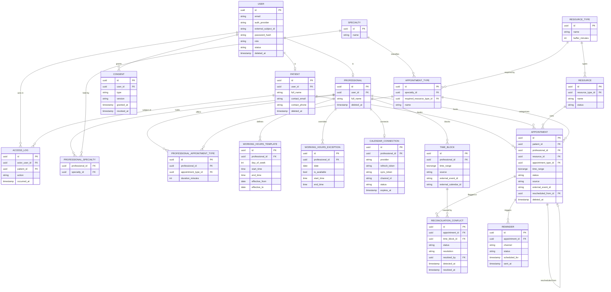

# Domain Model — Clinic Scheduling System

> **Status:** Phase 4 consolidated (Domain modeling & business rules).
> **Depends on:** `01-requirements.md` (Phases 1–3).
> **Upcoming phases:** 5 — Non-functional requirements · 6 — Architecture & technical decisions · 7 — OpenSpec translation & dev workflow.
> **Document language:** English.

---

## Design principle carried into this phase

The single most defensible idea in this project is that the "no double-booking" guarantee (SC-2) is enforced at three different layers, each for the right reason:

- **The database guarantees** hard interval non-overlap — the race-condition-proof floor.
- **The domain validates** the softer rules before persisting — for friendly UX and to reject most collisions early.
- **What cannot be prevented becomes a reconciliation conflict** — the human-in-the-loop case, because external calendar state arrives *after* a booking exists.

Every decision below serves that separation.

---

## 1. Locked decisions (this phase)

| ID | Decision | Choice |
|---|---|---|
| A | Where "no double-booking" lives | Domain validates (UX) + DB `EXCLUDE` constraint (correctness) — defense in depth |
| B | Time representation | Continuous interval (`start`/`end`), not pre-generated slots |
| C | Duration variability | Variable **per professional × appointment type** (junction entity carries duration) |
| D | Confirmation step | None — booking goes straight to `Scheduled` (availability already validated) |
| E | Reconciliation conflict | Separate `ReconciliationConflict` entity, not an appointment sub-state |
| F1 | Turnaround buffer | Parametrized per `ResourceType`, initial value **15 min** |
| F2 | Resource assignment | Automatic — system picks any free resource of the required type |
| F3 | Cancellation cutoff | Configurable, initial value **24 h** before start |
| G1 | Internal-block race floor *(added during walking-skeleton explore)* | Professional-scoped transaction lock on both schedule-mutating paths (booking + internal-block creation) closes the cross-table race |
| G2 | Internal-block reconciliation catch-all *(added during walking-skeleton explore)* | Periodic reconcile sweep widened to also detect appointment↔internal-block overlaps |

---

## 2. Entities

Grouped by responsibility. All entities are soft-delete only (I10).

### Identity & access
- **User** — identity + authentication. `authProvider` (Google | Internal), `externalSubjectId` (Google `sub`, for OIDC users), `passwordHash` (internal accounts only), `role` (Patient | Professional | FrontDesk | Administrator), `status`.

### People
- **Patient** — 1:1 with `User`. Minimal PII (LGPD minimization): `fullName`, `contactEmail`, `contactPhone`. No clinical data (anti-scope).
- **Professional** — 1:1 with `User`. Holds specialties, working-hour template, and calendar connection.

### Reference / configuration
- **Specialty** — e.g. Cardiology, Dermatology.
- **ProfessionalSpecialty** — junction; a professional holds one or more specialties.
- **ResourceType** — e.g. consultation room, ultrasound room. Carries `bufferMinutes` (F1).
- **Resource** — a concrete room/equipment of a `ResourceType`; has `status`.
- **AppointmentType** — belongs to a `Specialty`, requires a `ResourceType`. The "what kind of visit" concept that ties the three constraints together.
- **ProfessionalAppointmentType** — junction (professional × appointment type) carrying `durationMinutes` (Decision C). This is what lets Dr. A run a cardiology visit in 40 min and Dr. B in 50 min.
- **WorkingHoursTemplate** — recurring availability per professional (`dayOfWeek`, `startTime`, `endTime`, effective dates).
- **WorkingHoursException** — one-off, **per-professional** overrides (an individual's extra shift or day off). Clinic-wide holidays are out of MVP scope — a shared clinic calendar would be a new concept; for now a clinic-wide closure is modeled as one exception per professional.

### Scheduling core
- **Appointment** — aggregate root. References patient, professional, resource, appointmentType; `timeRange` (`start`/`end`); `status` (state machine); `source` (self-service | front-desk); `externalEventId` (outbound sync idempotency); `rescheduledFromId` (self-reference preserving history).
- **TimeBlock** — professional unavailability. `source` (Internal | External); `timeRange`; `externalEventId` / `externalCalendarId` (populated when source = External).

### Integration
- **CalendarConnection** — one per professional. `provider`, `refreshToken` (secured), `syncToken` (incremental sync — P-2), webhook `channelId`, `status`, `expiresAt`.
- **ReconciliationConflict** — links an `Appointment` to the external `TimeBlock` that collides with it. `status` (Open | Resolved), `resolution`, `resolvedBy`, `detectedAt`, `resolvedAt`.

### Compliance / cross-cutting
- **Consent** — per user, `type` (DataProcessing | CalendarSync), `version`, `grantedAt`, `revokedAt`.
- **AccessLog** — records staff access to a patient's personal data (`actorUserId`, `patientId`, `action`, `occurredAt`). A patient accessing their own data is not logged.
- **Reminder** — lightweight notification record per appointment (`channel`, `status`, `scheduledFor`, `sentAt`). Channel pending P-1.

---

## 3. Appointment state machine

```
        book
  ──────────────▶  Scheduled
                      │
      ┌───────────────┼───────────────┬───────────────┐
      ▼               ▼               ▼               ▼
  Completed        No-show        Cancelled      Rescheduled
 (attended)   (patient absent)  (patient/desk)  (spawns new appt)
```

- `Scheduled` is the only live state. Entry is **atomic** and **optimistic**: the domain validates the tri-constraint, and the DB `EXCLUDE` constraint rejects any losing racer with a friendly "slot just taken" message. No pessimistic slot holds are needed — the race is resolved at the correct layer.
- `Rescheduled` is terminal and **spawns a new linked `Scheduled` appointment** (`rescheduledFromId`), preserving history for audit/LGPD.
- `Completed` / `No-show` are set by the front desk in the **`visit-outcome`** change — observations about a visit that already happened, independent of calendar sync; 5a *defined* the states and 5a–5c deliberately left them unwired. No-show feeds SC-4 metrics.
- Reconciliation conflicts do **not** appear as a state (Decision E); the front desk resolves them via a normal transition (Cancelled or Rescheduled).

---

## 4. Availability computation (heart of UC-1)

For one professional, free time =
`WorkingHoursTemplate − WorkingHoursException`
**minus** the union of (active `Appointment`s + internal `TimeBlock`s + external `TimeBlock`s),
sliced by the `durationMinutes` from `ProfessionalAppointmentType`,
and cross-checked against the existence of a free `Resource` of the required `ResourceType`.

The solver respects each working-hour template's **effective-date range** (a template effective only from a future date does not apply to earlier dates) — the match is two-dimensional: `dayOfWeek` **and** the concrete date falling within the template's effective range. The interval arithmetic runs in the Domain core (C#), not SQL (see `04-architecture.md` §2).

**Slot identity (Q4):** a computed slot is identified in the wire contract by its **UTC instant** (plus professional and appointment type), never by its wall-clock label — so a DST fall-back day that legitimately yields two slots reading the same local time an hour apart in UTC stays unambiguous. The UI disambiguates the rare display collision. The booking request references the slot by UTC instant; the server assigns the resource itself (F2) and never trusts a caller-supplied resource id.

For **"any professional of specialty X"**, the solver runs this across every eligible professional and returns the union of slots, each already carrying which `(professional, resource)` pair satisfies it. The pairing is resolved server-side; the patient only sees "Thursday 2:00 PM available".

**Buffer handling (F1):** a resource's effective occupied interval for availability is `[start, end + bufferMinutes)`. Implemented in `availability-read`: trailing only, and applied to resources rather than to professionals, since turnaround belongs to the room and not to the person leaving it. This keeps turnaround time (cleaning/prep) out of the bookable window. Note: the buffer is applied in the **domain availability computation**, while the DB `EXCLUDE` constraint operates on the raw appointment interval. Consequence: two exactly-abutting bookings in the same room are theoretically race-possible. For the MVP this is acceptable; if strict buffer enforcement is later required, the resource exclusion constraint can be extended to an expression over the buffered range. Recorded as a conscious trade-off.

**Scheduling parameters (config, not code):** slot start step (default 15 min), minimum lead time (default 1 h), scheduling horizon (default 60 days).

---

## 5. Resource assignment & cancellation

- **Resource assignment (F2):** automatic. The system assigns any free `Resource` of the required `ResourceType`; the patient never picks a room.
- **Cancellation / reschedule (F3):** the patient may cancel or reschedule their own appointment up to a **configurable cutoff (default 24 h)** before start; inside the cutoff, only the front desk can. This is the concrete demonstration of RBAC + ownership-based authorization coexisting — the patient has power over their own data, bounded by a temporal business rule. The rule (patient-facing) lands in `booking-lifecycle`; the front-desk **override** is exercised in `booking-desk` — the transition method takes an *authority* (a `cutoffApplies` fact), keeping the core role-agnostic (same design bargain as I2's qualification fact).
- **Reschedule is scoped to the same professional** and appointment type; moving to a different professional is a **cancel + new booking**, not a reschedule (this also keeps the professional-scoped lock single-keyed — no two-lock deadlock).
- **Reschedule statement ordering (load-bearing):** the `EXCLUDE` indexes are partial (`WHERE status='Scheduled'`) and **non-deferrable** (evaluated per statement). So a reschedule must, within one transaction under the professional lock, **UPDATE the old row to `Rescheduled` first** (it leaves the partial index), **then INSERT the new row** — the reverse order fires the patient constraint against the still-live old row and always fails a same-patient reschedule. A naive test (move far away) passes while a near move fails, so an integration test moves an appointment a few minutes to catch it.
- On cancel, the corresponding Google Calendar event is removed (outbound sync). On reschedule (same professional), the **new appointment inherits the old `external_event_id` and the outbox emits a single patch/move** to the new time — *not* delete-then-create, which would show the visit twice if the delete fails and the create succeeds.

---

## 6. Aggregate invariants (`Appointment`)

Must always hold, regardless of code path:

- **I1** — `start < end`; duration equals the `ProfessionalAppointmentType.durationMinutes` **at booking time**, baked into `time_range`. Later changes to that duration affect only future searches, never existing appointments (surfaced by the S10 design; naturally holds because the appointment stores its own `time_range`).
- **I2** — the professional holds the `Specialty` of the `AppointmentType`. `ProfessionalSpecialty` is the **qualification gate** and the data source for this invariant: a `ProfessionalAppointmentType` (duration) may only be assigned for a type whose specialty the professional holds (enforced in `professional-configuration`; `config.specialty_not_held` otherwise). This keeps `ProfessionalSpecialty` a first-class concept (credentialing) distinct from `ProfessionalAppointmentType` (operational duration config), not derivable/duplicate data.
- **I3** — the `Resource` is of the `ResourceType` required by the `AppointmentType`.
- **I4 / I5 / I6** — no interval overlap for the same **professional**, the same **resource**, and the same **patient** (among active appointments).
- **I7** — no active appointment overlaps a `TimeBlock` for the same professional. Enforced on **both** mutating paths — booking checks `TimeBlock`s; internal-block creation checks active appointments and is refused on collision ("you have an appointment at 14:30; cancel it first"). Both paths run under a professional-scoped lock so the cross-table check is race-safe (see enforcement mapping, G1/G2).
- **I8** — respects minimum lead time and scheduling horizon at creation.
- **I9** — state transitions only per the state machine.
- **I10** — soft-delete only; never hard-delete (audit/LGPD).

### Enforcement mapping (the interview-grade distinction)

| Concern | Enforced by | Mechanism |
|---|---|---|
| I4 / I5 / I6 (hard overlap, appointment↔appointment) | **Database** | `EXCLUDE USING gist` on `tstzrange` with `btree_gist` (`professional_id WITH =`, `time_range WITH &&`), **partial** `WHERE status = 'Scheduled'` so cancelled/rescheduled rows free the slot |
| I1–I3, I8 (business rules) | **Domain** | Validated in the aggregate before persistence; friendly errors |
| I7 — appointment ↔ **internal** block | **Domain + lock + reconciliation** | Domain refuses the collision on **both** mutating paths (booking checks blocks; block creation checks appointments); a **professional-scoped transaction lock** (transaction-scoped advisory lock keyed on `professional_id`, or `SERIALIZABLE`) closes the cross-table read-then-write race (G1); the **periodic reconcile sweep** is the catch-all for any residual overlap (G2) |
| Appointment ↔ **external** block | **Reconciliation** | Not a DB constraint (different tables; external block arrives later) → `ReconciliationConflict(Open)` + front-desk signal |

This converts the previously convention-only row (appointment vs. internal block) into a **third distinct mechanism**, so every source of "professional is busy" has a real floor — the SC-2 promise ("by construction, not by convention") holds across all three.

Why a professional-scoped lock rather than `SERIALIZABLE` on the hot path: booking is frequent and block creation is rare, so a lock keyed at the professional grain serializes only the two paths that touch one professional's busy set (contention ≈ 0) without imposing serialization-failure retries on every booking. `SERIALIZABLE` is the declarative alternative.

---

## 7. Synchronization mechanics (UC-2)

**Inbound:** webhook → fetch changes via `syncToken` (incremental sync, P-2) → for each "busy" event, upsert a `TimeBlock(source = External)`; if it collides with an active appointment, create a `ReconciliationConflict`. Webhook deliveries repeat, so dedupe by event ID + `syncToken`.

**Outbound:** on entering `Scheduled`, create an event in the professional's calendar — **idempotent** by storing `externalEventId` (never create twice). On cancel/reschedule, delete/update by that ID.

**Resilience:** refresh expired tokens; retry with backoff on rate limit (HTTP 429); `CalendarConnection.status` reflects revoked consent so the system stops retrying and prompts reconnection.

**Reconcile sweep scope (G2):** the periodic reconcile job (safety net, `04-architecture.md` §6, Decision V) runs incremental sync **and** also scans for appointment↔`TimeBlock` overlaps for the same professional — covering **both** external and **internal** blocks. On the common path an internal-block collision is refused synchronously at creation (I7); the sweep is the catch-all that surfaces any residual overlap (from a bug, a manual DB change, or an edge that slips the lock) to the front desk as a `ReconciliationConflict` rather than leaving it silent.

---

## 8. LGPD (awareness, not certification)

- **Consent** captured at two points, both versioned: patient data processing (at registration) and calendar sync (professional, at connection).
- **AccessLog** records staff access to patient personal data.
- **Minimization:** store the minimum patient data; no clinical data (anti-scope).
- **Soft-delete** designed to permit future anonymization, without building the full data-subject-request workflow.

---

## 9. Entity-relationship diagram (full)



---

## 10. Carried-over open items

| # | Item | Resolve in |
|---|---|---|
| P-1 | Reminder channel (email via SMTP / mail catcher vs. in-app) | Phase 5 (NFR) |
| P-2 | Incremental-sync design (`syncToken`) + webhooks | Phase 6 (architecture) |
| P-3 | Calibrate architecture layering (avoid full Clean Architecture by reflex) | Phase 6 |
| P-4 | Strict buffer enforcement at DB level (expression over buffered range) — deferred trade-off from §4 | Phase 6 (if needed) |
| P-5 | `Professional.full_name` — present in the §9 ERD, never implemented. 3b created the record with only a user reference and S7 lists by email, which is fine for an administrator who knows their own staff and not fine for a patient. `booking-core` needed a patient-facing label and derived one from the account's local part, deliberately behind a `displayName` field so the server can start telling the truth without any client changing | **Resolved in `booking-desk` (5c).** The column landed nullable and S7 grew the field; the derived label survives as the fallback for a professional nobody has named yet, because the configuration record is born on first save and S7 lists invited professionals who have none. One helper (`ProfessionalLabel`) answers the question for every surface, so the portal and the staff console cannot disagree about who somebody is. The `displayName` field paid off exactly as intended: **no client changed** · **NB:** this `02`-local P-5 (`full_name`) is distinct from the outbox `P-5` in `03`/`04` (Resolved) |