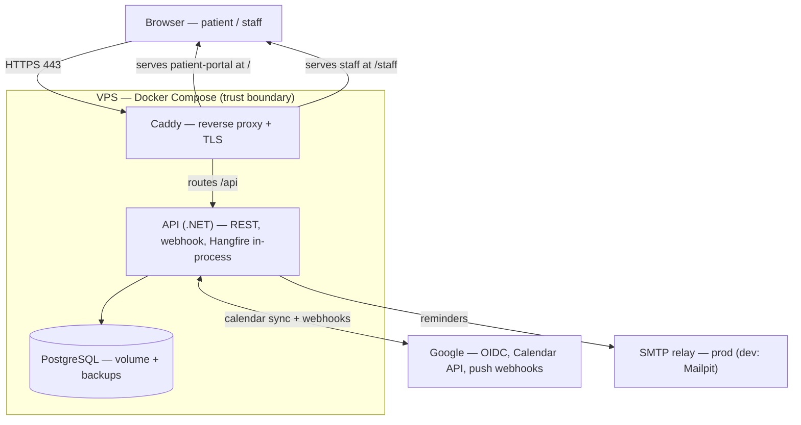

# Architecture & Technical Decisions — Clinic Scheduling System

> **Status:** Phase 6 consolidated (Architecture & technical decisions).
> **Depends on:** `01-requirements.md`, `02-domain-model.md`, `03-nfr.md`.
> **Upcoming phase:** 7 — OpenSpec translation & dev workflow.
> **Document language:** English.

---

## Guiding principle

Put architecture where the complexity is, not uniformly. The genuinely hard parts (tri-constraint invariants, the appointment state machine, resilient external integration) get real structure; the CRUD-ish parts stay thin. Every technology must answer "what problem does it solve here?" — the same bar applied to capabilities and NFRs. This is also the anti-over-engineering rule: knowing when *not* to add a tool is a first-class decision.

---

## Locked decisions (this phase)

| ID | Decision | Choice |
|---|---|---|
| K | Backend architecture | Vertical Slice + protected domain core, **no MediatR** |
| L | Persistence | EF Core (writes) + Dapper (raw SQL over `tstzrange`/GiST on the **booking write path**, change 5) — CQRS-lite. The **availability solver** is interval arithmetic in the Domain core (C#), fed by a bounded input read — see §2 |
| M | Frontend | Feature folders + TanStack Query + react-i18next |
| N | Production email | External transactional SMTP relay (free tier) |
| O | Background jobs | Hangfire with PostgreSQL storage |
| P | Outbox pattern | Adopted in the MVP |
| Q | Hangfire server placement | In-process with the API (single deployable) |
| R | Rate limiting | Native .NET middleware, in-process |
| S | Redis | Out of scope — `IMemoryCache` for reference data; no cache on availability path |
| T | Reverse proxy | Caddy (automatic TLS), serves SPA + routes `/api` |
| U | Network & secrets | Only Caddy public; API/DB internal; secrets outside the repo |
| V | Sync trigger | Webhook-driven + periodic reconcile job as safety net |

---

## 1. Backend architecture (K)

**Vertical Slice Architecture** organized by feature (Booking, Availability, Calendar sync, Reconciliation, Admin config), each slice owning its endpoint, handler, request/response DTOs, and validation. Handlers are invoked directly by endpoints — **no MediatR**, consistent with the established preference for application services called directly.

The slices are thin. A small, **protected domain core** holds the genuinely complex logic: the `Appointment` aggregate, invariants I1–I10, the state machine, and the availability solver. Slices orchestrate (receive request → call the core → persist → respond); they do not re-implement domain rules.

- **Why this over Clean Architecture:** it differentiates from the layered/Clean approach used elsewhere in the portfolio (new signal), the structure maps 1:1 to the use cases (the code tells the domain story), and it carries less ceremony for a domain this size.
- **Honest cost:** vertical slice without discipline invites duplication across slices. Mitigation: all invariant/domain logic lives in the protected core and is reused; the risk is contained by convention + the core boundary.

## 2. Persistence (L) — CQRS-lite

- **Writes** go through the `Appointment` aggregate via **EF Core**, which enforces invariants and persists within the transaction that also protects the DB `EXCLUDE` constraint.
- **The availability solver** is **interval arithmetic in the Domain core (C#)**: a bounded read fetches the raw inputs for the requested date window (working-hour templates + exceptions, internal/external busy intervals, resources), and the Domain computes free slots (wall-clock→UTC via NodaTime, duration slicing, per-slot pairing with a free resource of the required type including its turnaround buffer, any-professional union). At clinic scale the input is small, so the computation belongs in the protected, unit-testable core — and the DST/interval logic is exactly what wants to be pure domain code. This resolves the earlier §1/§2 tension: the solver is Domain, not SQL.
- **Dapper** (a micro-ORM: hand-written SQL, parameterized, cached IL-emitted materializer; no change tracking, near-ADO.NET) earns its place on the **booking write path**, delivered by `booking-core`. Where it landed is narrower than this section first predicted, and the difference is worth recording:
  - **EF Core still performs the appointment insert.** The aggregate is the write model (the first clause above), and the `EXCLUDE` constraints protect the row whichever client issues the `INSERT`. Adding a second insert path so Dapper could "own the write" would have meant two ways to create an appointment — the opposite of what an aggregate is for.
  - **Dapper owns exactly what EF cannot express**: `pg_advisory_xact_lock` (the professional-scoped lock, G1) and the `time_range && tstzrange(…)` overlap reads that feed the busy set on both the read and the write path. That is the genuinely hand-written SQL over `tstzrange` and GiST this decision was justified by.
  - **The load-bearing detail:** Dapper runs on the `DbContext`'s own connection, inside the `DbContext`'s transaction. A transaction-scoped advisory lock taken on another connection is released immediately and protects nothing, while every functional test still passes — so the absence of a transaction throws rather than being tolerated, and an integration test asserts the lock actually blocks.
  - CQRS-lite still holds: the aggregate for writes, tuned SQL where the write path needs what the ORM cannot say.
  - **The ORM's own statement ordering is not a contract, and `booking-lifecycle` found that out by testing it.** A reschedule must terminate the original appointment *before* inserting its replacement: the `EXCLUDE` indexes are partial on the live state and non-deferrable, so the old row has to leave them first or the insert collides with it. EF Core builds and orders its own command batch, and in this case happens to emit the `UPDATE` first — which means the handler would have been correct *by accident*, protected by an implementation detail until an upgrade or a refactor changed it. **Reversing the two statements left every test in the suite green.** Two consequences, both applied: the handler pins the order with two `SaveChanges` calls inside one transaction rather than trusting one, and the rule is asserted against raw SQL where it is genuinely true rather than against the handler where it is not. Recorded in `02-domain-model.md` §5 as well, so the fact outlives this implementation.
- **Framing:** writes and reads have different needs — the aggregate for correctness, an optimized query path for the hot read. Honest cost: two data-access technologies + hand-maintained SQL that can drift from schema (mitigated by integration tests against a real PostgreSQL).

## 3. Frontend architecture (M)

React + TypeScript, shadcn/ui + Tailwind, feature-folder structure mirroring the backend slices. **Two separate frontends in one repository** (see `06-ui-surfaces.md`, decision Z1), because the public and internal surfaces have distinct layout, navigation, and bundle needs:

- **`apps/patient-portal`** — public, served at `/`. Patient authenticates via Google OIDC. Design-showcase surface (WCAG 2.1 AA priority).
- **`apps/staff`** — internal, served at `/staff`. Authenticated app-shell with role-conditioned navigation (Professional / Reception / Administrator). Utilitarian.
- **`packages/shared`** — shared code: API client, generated types, i18n resources, and common UI primitives, consumed by both apps.

Each app has its own build and its own router `basename` (`/` vs `/staff`). **TanStack Query** manages server state — availability is volatile server state (refetched, near-real-time), and this avoids hand-rolling cache logic that could show stale (already-taken) slots. **react-i18next** owns translation (pt-BR / en); the API returns error codes + params, never translated prose. Accessibility target WCAG 2.1 AA (Radix primitives under shadcn help by default).

## 4. Background jobs (O, Q)

**Hangfire with PostgreSQL storage**, running **in-process** with the API (single deployable for the MVP; trivially promotable to a dedicated worker later). Justified by four distinct async needs: scheduled reminders, webhook processing/retries, outbox dispatch, and **renewing Google Calendar watch channels before they expire** (a recurring job — missing this silently stops inbound sync). Reuses the existing PostgreSQL (no Redis), is free, and its dashboard serves observability. Rolling a hand-built `IHostedService` would re-implement scheduling, retries, persistence, and a dashboard — over-engineering in the wrong direction.

## 5. Outbound sync — the outbox pattern (P)

Solves the **dual-write problem**: there is no distributed transaction between local PostgreSQL and the Google API, so doing both in sequence leaves a failure window (appointment saved but event not created, or vice-versa).

- In the **same local transaction** that persists the `Appointment`, an `outbox` row recording the intended side effect is written. One transaction → both rows exist or neither; the inconsistency is not representable.
- The external call happens **outside** the transaction: the Hangfire dispatcher reads `pending` rows, calls Google, marks `sent` (storing `externalEventId`) on success, retries with backoff on failure, and dead-letters after N attempts (→ human signal).
- Delivery semantics are **at-least-once**; paired with **idempotent** event creation (keyed on `externalEventId`, never created twice), repeated dispatch is harmless. This pair is the complete mature pattern.
- **Why it matters here (not just technically):** a silently failed outbound sync means the professional's Google Calendar doesn't show the appointment, so they may book a personal conflict over it — exactly the failure the product exists to prevent. Honest cost: one table + one job, and eventual consistency (the event appears seconds later), which is irrelevant for a calendar.

## 6. Inbound sync & reconciliation (V, P-2)

- **Primary (low latency):** Google push webhook → Hangfire job fetches changes via `syncToken` (incremental sync, keeping call volume low) → upserts external `TimeBlock`s → if one collides with an active appointment, creates a `ReconciliationConflict(Open)` for the front desk (human-in-the-loop). Webhook deliveries repeat → dedupe by event ID.
- **Safety net (resilience + dev):** a **periodic reconcile job** runs the same incremental sync on a schedule. Webhooks are best-effort and can be missed, so a periodic sweep is a real production practice — and it makes local dev work without any tunnel. A `cloudflared` tunnel is optional in dev only to exercise the webhook handler itself.
- **Watch channels** are renewed by a recurring job before expiry.

## 7. Rate limiting & caching (R, S)

- **Rate limiting:** native .NET middleware, in-process. The deployment is a single VPS instance, so in-process limiting is sufficient; distributed limiting (which would need a shared store) solves a multi-instance coordination problem the project doesn't have.
- **Caching:** `IMemoryCache` (in-process, free) for reference data (specialties, resource types, appointment types, working-hour templates — read-often, change-rarely). **No cache on the availability path** — it changes in real time and caching would risk stale slots (conscious decision).
- **Redis is deliberately out of scope.** Every Redis candidate dissolves at this scale: availability is intentionally uncached, reference data fits `IMemoryCache`, session/revocation lives in PostgreSQL, Hangfire storage is PostgreSQL. **Explicit trigger for revisiting:** horizontal scaling to multiple API instances (distributed rate limiting + shared cache + distributed Hangfire coordination). Horizontal scale is out of scope (single VPS; multi-clinic is anti-scope).

## 8. Security & secrets (U, cross-ref `03-nfr.md` §2)

- **Unified session:** OIDC and internal accounts both resolve to the app's own session (HttpOnly, `SameSite`, `Secure` cookie + revocation table).
- **OAuth calendar tokens encrypted at rest.**
- **Secrets outside the repo:** Google client secret, token-encryption key, SMTP credentials via env files / Docker secrets.
- **Two-layer authorization:** RBAC by role + ownership check on patient data.

## 9. Deployment topology (T, U)

Single VPS, Docker Compose. Only Caddy is publicly exposed (80/443); it terminates TLS (automatic Let's Encrypt — load-bearing, since OAuth redirect URIs and Google webhooks require valid public HTTPS), and routes three ways: the **patient-portal** static build at `/`, the **staff** static build at `/staff`, and `/api` to the API. The API and PostgreSQL sit on an internal network; the DB is reachable only by the API. In dev, a Mailpit container replaces the SMTP relay (config-only difference).

---

## 10. Open items — status after Phase 6

| # | Item | Status |
|---|---|---|
| P-2 | Incremental sync (`syncToken`) + webhooks | **Resolved** (§6): webhook primary + reconcile safety net |
| P-3 | Architecture layering calibration | **Resolved** (§1): vertical slice + protected core |
| P-4 | Strict buffer enforcement at DB | **Deferred** (conscious trade-off): buffer stays in domain availability; can extend the resource exclusion to a buffered range if ever required |
| P-5 | Outbox pattern | **Resolved** (§5): adopted in MVP |
| P-6 | Deployment topology + TLS | **Resolved** (§9): Compose + Caddy |
| P-7 | Dev webhook reachability | **Resolved** (§6): reconcile job (+ optional cloudflared) |

All Phase 6 items closed except P-4, which is a documented, intentional deferral.