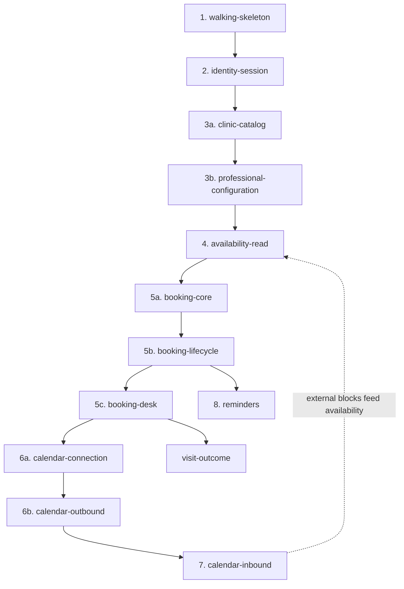

# OpenSpec Translation & Dev Workflow — Clinic Scheduling System

> **Status:** Phase 7 consolidated (OpenSpec translation & dev workflow). **Planning complete.**
> **Depends on:** `01-requirements.md`, `02-domain-model.md`, `03-nfr.md`, `04-architecture.md`.
> **Document language:** English.

---

## Guiding principle

Documents 01–04 are the **spec substrate**: they are the source of truth that `/opsx:explore` and `/opsx:propose` consume. The phases were not preparation for OpenSpec — they _are_ the durable context OpenSpec references. This is what preserves code ownership: you delegate the _translation_ of decisions that are already yours, not the decisions themselves. You review every proposal before any code, and every change's diff before it is archived.

---

## Locked decisions (this phase)

| ID  | Decision           | Choice                                                                                                |
| --- | ------------------ | ----------------------------------------------------------------------------------------------------- |
| W   | Change granularity | Right-sized — one change per demonstrable vertical increment (reviewable in one sitting)              |
| X   | Capabilities       | Six: Identity & session, Clinic configuration, Availability, Booking, Calendar integration, Reminders |
| Y   | Build order        | 13 dependency-ordered changes (after splits), from walking skeleton to reminders                     |

---

## 1. OpenSpec mechanics (reference)

- **Setup (terminal, once):** `npm install -g @fission-ai/openspec@latest`, then `openspec init` inside the repo — this installs the `/opsx:*` slash commands into the AI tool (Claude Code). After that, work happens in chat.
- **Per-change rhythm (chat):** `/opsx:explore` (optional — think the increment through against docs 01–04) → `/opsx:propose <change-id>` (drafts `proposal.md`, `specs/`, `design.md`, `tasks.md`) → **human review of the proposal** → `/opsx:apply` (implements, checking off tasks) → **human review of the diff** → `/opsx:archive` (folds the delta into the living spec).
- **Change folder:** each change lives in `openspec/changes/<change-id>/`. Delta specs mark sections `ADDED` / `MODIFIED` / `REMOVED`.
- **Not rigid phase gates:** artifacts can be updated anytime; supporting actions include `update`, `sync`, and `verify`. `openspec validate <change-id> --strict` checks a change.
- OpenSpec works best with high-reasoning models — a good fit for Claude Code here.

## 2. Capabilities (living spec areas)

| Capability               | Covers                                                                                                                                                    | Use cases          |
| ------------------------ | --------------------------------------------------------------------------------------------------------------------------------------------------------- | ------------------ |
| **identity-session**     | Google OIDC + internal accounts, unified session, RBAC roles, ownership-authorization primitive                                                           | Hybrid auth        |
| **clinic-configuration** | Admin CRUD: specialties, resource types, resources, appointment types, professional×type durations, working-hour templates, buffer                        | UC-4               |
| **availability**         | Tri-constraint solver (Dapper read), specific + any-professional variations                                                                               | UC-1 (read)        |
| **booking**              | Atomic booking, `EXCLUDE` constraint, invariants, state machine, automatic resource assignment, cancellation cutoff; reschedule/cancel (delivered by `booking-core` + `booking-lifecycle` + `booking-desk`)                    | UC-1 (write), UC-3 |
| **calendar-integration** | Professional OAuth connection, outbound sync (outbox), inbound sync (webhook + `syncToken`), reconciliation conflicts + resolution, watch-channel renewal | UC-2               |
| **reminders**            | Scheduled reminder job + email via SMTP                                                                                                                   | UC-5               |

## 3. Build order (13 changes, dependency-ordered)

Each change delivers a demonstrable increment. Three capabilities are split along their natural seam per the right-sized granularity rule: `clinic-configuration` (catalog, then professional config), `booking` (core, lifecycle, then desk), and `calendar-integration` (connection, outbound, then inbound). Plus `visit-outcome`, a small change owning the two terminal states booking left unwired.

1. **walking-skeleton** _(done)_ — Compose (Caddy/api/db), solution structure (slices + protected core), one end-to-end vertical slice, health check. De-risks the infrastructure first.
2. **identity-session** _(done)_ — hybrid auth, unified session, roles, ownership primitive. Also delivered the two seams every later change's tests depend on: acting as a role, and validating a Google token offline. Google's calendar scope was deferred to change 6 via incremental authorization; see `08-google-setup.md`.
   3a. **clinic-catalog** — what the clinic offers: specialties, resource types (+ buffer), resources, appointment types. Flat CRUD (S8, S9, S10) with deactivation (soft-delete) refusal rules. Zero dependency on 3b.
   3b. **professional-configuration** — what a professional does and when: `Professional` row, specialties, per-type durations, working-hour templates + exceptions (S7). Introduces the clinic timezone (Decision H) and the dev seed. Depends on 3a.
3. **availability-read** — the availability engine (interval arithmetic in the Domain core; wall-clock→UTC via NodaTime with a DST-observing test zone; duration slicing; per-slot pairing with a free resource of the required type, buffer included; specific + any-professional union; respects working-hour **effective-date** ranges). Also brings **internal `TimeBlock` (source=Internal) + S3 Block time** (option C) so the subtraction has a real, producer-backed subtrahend and a browser surface — internal blocks were mis-filed under the Google capability. Appointment-based subtraction and the `EXCLUDE`/GiST machinery stay in change 5 (their producer). Availability output is API/test-verified until P2 lands in change 5.
5a. **booking-core** — the `Appointment` aggregate + state machine; the three enforcement floors (DB `EXCLUDE`/I4–I6; domain I1–I3, I8; **and the I7 refusal + G1 professional-scoped lock retrofitted into the availability blocks write path** — 5a creates the racer, so this is a **Modified Capability** on `availability`, not just new code); automatic server-side resource assignment (F2 — never trust a caller-supplied resource id); a lead-time/horizon agreement test with the read path; Dapper on the write path (`tstzrange`/GiST exist now). Screens P2, P3, P4. Demonstrable: a patient searches (P2) and books (P3→P4), and double-booking is impossible by construction.
5b. **booking-lifecycle** — "an appointment can change": Cancelled/Rescheduled transitions + guards, `rescheduled_from_id`, the **reschedule statement ordering** (UPDATE old→`Rescheduled` *before* INSERT new — the partial `EXCLUDE` indexes are non-deferrable; see `02-domain-model.md` §5), the F3 cutoff parameter + the patient-facing rule + the transition method parameterized to accept an **authority** (`cutoffApplies`; the patient path always passes "applies"), ownership authorization on an appointment. Reschedule is scoped to the **same professional** and appointment type (a different professional is a cancel + new booking — dissolves the two-lock deadlock). Screens P5, P6. Cancel releases the slot/resource; external-calendar propagation is change 6, recorded as a seam here, not silently deferred. Demonstrable: a patient cancels and the slot comes back. Depends on 5a.
5c. **booking-desk** — "staff see and run the day": `Professional.fullName` (P-5, entered on S7 — lands here because S1/S4/S5 are the three surfaces that need it), **book-on-behalf** as a **Modified Capability** on `booking` (the role-gated explicit `patientId` per 5a's task 8.2 — the shipped scenario "staff cannot book through the patient path" becomes false), `AppointmentSource.FrontDesk`, the front-desk cutoff **override** (exercises the authority path 5b built), and `AccessLog` rows when staff read patient PII (S1/S4 are the first screens that need the trail — the primitive already exists). Screens S1, S4, S5. Demonstrable: reception books a walk-in inside the cutoff. Depends on 5b.
6a. **calendar-connection** — OAuth incremental authorization (`include_granted_scopes=true` + offline access), consent captured on S2, the `CalendarConnection`, and the refresh-token **encrypted at rest** (the repo's first secret at rest — new env var, new Compose wiring). Demonstrable on its own: a professional connects their calendar and the status screen says so. Depends on 5c.
6b. **calendar-outbound** — Hangfire + Postgres storage (first scheduler), the outbox (**INSERT inside the Dapper advisory-lock transaction**, not a nearby EF one), the dispatcher, idempotency (`external_event_id`), **snapshot** payloads, propagation on all three write paths (reschedule = **patch/move** the event, not delete+create), dead-letter surfaced on the **Hangfire dashboard (admin-only, via Caddy)**. Collects the two deferred session-expiry sweeps now that Hangfire exists. A booking for a professional with no connection does not fail and writes no outbox row (no backfill on later connect). Depends on 6a.
7. **calendar-inbound** — **external** `TimeBlock`s only (source=External): webhook, incremental sync, reconcile job (widened to the internal↔appointment catch-all, G2), `ReconciliationConflict` + front-desk resolution (S6), watch-channel renewal. Internal blocks + S3 moved to change 4.
8. **reminders** — scheduled job, email via SMTP (Mailpit in dev).
- **visit-outcome** — `Complete()` / `MarkNoShow()` on the aggregate + the front-desk marking UI on S4. Owns the two terminal states 5a *defined* but 5a–5c deliberately left unwired (visit observations, not a calendar concern). Slots with reminders (8) — together they demonstrate SC-4 (reminders reduce no-shows). Depends on 5c.

Both `clinic-catalog` and `professional-configuration` contribute deltas to the single `clinic-configuration` capability.

The dashed edge is the feedback relationship: once `calendar-inbound` lands, external blocks become part of the tri-constraint availability computation.

## 4. Per-change workflow loop

For each change, in Claude Code:

1. **Branch** — one branch per change (git discipline: clean tree before propose).
2. **`/opsx:explore`** _(optional)_ — reason about the increment against docs 01–04.
3. **`/opsx:propose <change-id>`** — Claude Code drafts proposal + spec deltas + design + tasks.
4. **Review the proposal** — the ownership checkpoint. Approve or adjust before any code.
5. **`/opsx:apply`** — Claude Code implements, checking off tasks; commit after apply/verify.
6. **Review the diff** — read and understand the full change.
7. **`/opsx:archive`** — fold the delta into the living spec (main-branch check before archive).

A community skill can enforce this git discipline automatically (clean tree before propose, commits after apply/verify, main-branch checks before archive).

## 5. Definition of Done (per change)

- **Tests:** unit tests for domain-core invariants; integration tests against a real PostgreSQL for the `EXCLUDE` constraint and the Dapper availability queries.
- **i18n:** pt-BR / en keys present for any new user-facing strings.
- **Behavior:** the demonstrable increment works end to end.
- **Validation guide:** `openspec/changes/<id>/validation.md` lists the manual, human-only checks (browser UX, both locales, Compose behaviors); they are run against the local app and confirmed before archive (see `00-context.md` §9).
- **Spec:** the change is archived into the living spec; `openspec validate --strict` passes.

## 6. The five-document set

| Doc                       | Content                                                            |
| ------------------------- | ------------------------------------------------------------------ |
| `01-requirements.md`      | Problem, scope, actors, use cases, MVP cut                         |
| `02-domain-model.md`      | Entities, state machine, invariants, ERD, business rules           |
| `03-nfr.md`               | i18n, security, resilience, observability, runtime/tooling         |
| `04-architecture.md`      | Backend/frontend architecture, persistence, jobs, sync, deployment |
| `05-openspec-workflow.md` | This document — capabilities, build order, dev workflow            |

## 7. Next action

Done and on `main`: walking-skeleton, identity-session, clinic-catalog, professional-configuration, availability-read, `staff-google-guard`, **booking-core (5a)**, **booking-lifecycle (5b)** and **booking-desk (5c)** — plus two refinement changes outside the numbered increments, `staff-google-guard` and `booking-surface` (UI adjustments to the patient booking screens). The Google OAuth client is configured (`08-google-setup.md` §"Do this now"), so the Google-only screens are human-validatable.

Change 5 is split three ways (see §3) and **all three are done**: **5a — booking-core**, **5b — booking-lifecycle**, **5c — booking-desk** (`Professional.fullName` closing P-5, book-on-behalf as a Modified Capability on `booking`, the front-desk cutoff override finally called, `AccessLog` on staff PII reads; S1, S4, S5).

The calendar work is **split** (see §3), and **6a — calendar-connection is done**: incremental authorization with `include_granted_scopes=true` and offline access, started only from S2; `CalendarConnection` with its own state machine; the refresh token **encrypted at rest** under `Calendar__TokenEncryptionKey` (the repo's first secret at rest); `ConsentType.CalendarSync` finally written, and withdrawable on the screen that granted it; the declined-scope case given its own code because a granular consent screen can approve everything except the calendar. It propagates nothing — no scheduler, no outbox, no `external_event_id` — so the seam 5b and 5c both declared is exactly where they left it.

Next is **6b — calendar-outbound** (Hangfire + the outbox, per `04-architecture.md` §5's locked implementation specifics). It also collects the two session-expiry sweeps deferred to "when Hangfire lands". A small **`visit-outcome`** change owns `Complete()`/`MarkNoShow()` and slots with reminders (8); `Appointment.cs`'s stale comment claiming `booking-desk` records them **was corrected in 6a** and now points at `visit-outcome`.

**6a's validation guide has not been run** — it needs a real Google professional connecting, revoking and reconnecting a real calendar (the `staff-google-guard` 9.6 wall), plus two manual Google Console steps documented in `08-google-setup.md`. Every automated tier in 6a talks to a stubbed Google, so this is the one gap no test closes.

**Both debts that 5b carried are now closed** (2026-08-24), in the artifacts that own them rather
than here:

- **F8, the availability response size.** Measured and recorded in `availability-read`'s design F8
  note. The prediction was right — growth is linear in professionals and window at ≈170 bytes per
  slot — and the conclusion is that it is not a problem yet: the worst realistic case (20
  professionals, the widest permitted window) is **614 KiB uncompressed**, and the seeded clinic's is
  62 KiB. The genuinely new fact is that the cost is **payload, not compute**: the solver answers a
  twenty-professional month in under 20 ms, so F1's small-inputs bet is winning comfortably. The
  revisit trigger is re-armed at roughly ten professionals, not discharged.
- **`availability-read`'s validation guide.** Closed in its own Outcome as *discharged rather than
  executed*: the Google client it was blocked on now exists, and `booking-core`'s checks 13 and 14 —
  which were run — cover S3 as a real professional in both locales. One gap is named and left open:
  the wall-clock round trip on S3 specifically has still never been seen by a person.

Per change: branch, `/opsx:explore` (optional), `/opsx:propose <change-id>`, review the
proposal, `/opsx:apply`, review the diff, `/opsx:archive`, merge to `main`.

---

## Carried-over open item

| #   | Item                                  | Status                                                                                                       |
| --- | ------------------------------------- | ------------------------------------------------------------------------------------------------------------ |
| P-4 | Strict buffer enforcement at DB level | Deferred (documented in `04-architecture.md` §10); revisit only if strict turnaround enforcement is required |