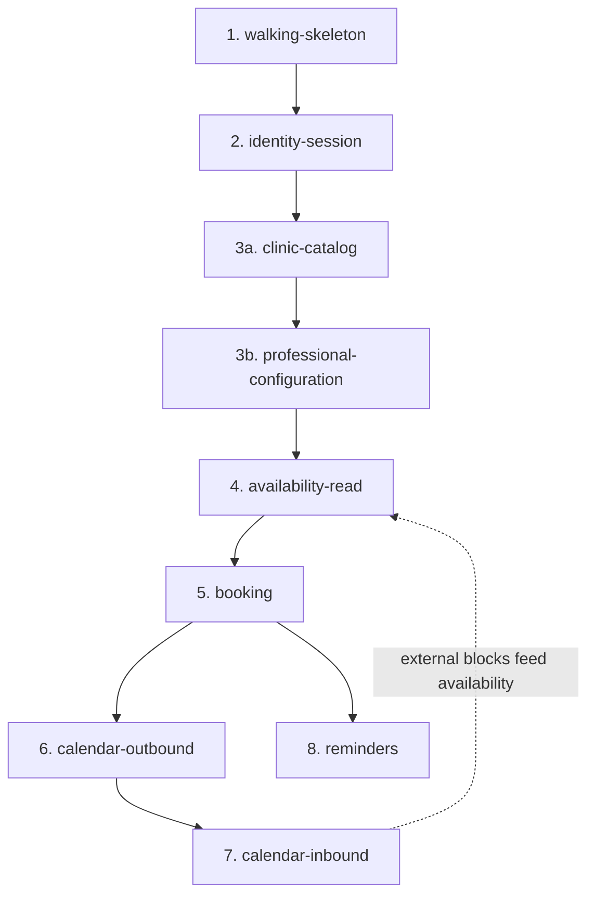

# OpenSpec Translation & Dev Workflow — Clinic Scheduling System

> **Status:** Phase 7 consolidated (OpenSpec translation & dev workflow). **Planning complete.**
> **Depends on:** `01-requirements.md`, `02-domain-model.md`, `03-nfr.md`, `04-architecture.md`.
> **Document language:** English.

---

## Guiding principle

Documents 01–04 are the **spec substrate**: they are the source of truth that `/opsx:explore` and `/opsx:propose` consume. The phases were not preparation for OpenSpec — they _are_ the durable context OpenSpec references. This is what preserves code ownership: you delegate the _translation_ of decisions that are already yours, not the decisions themselves. You review every proposal before any code, and every change's diff before it is archived.

---

## Locked decisions (this phase)

| ID  | Decision           | Choice                                                                                                |
| --- | ------------------ | ----------------------------------------------------------------------------------------------------- |
| W   | Change granularity | Right-sized — one change per demonstrable vertical increment (reviewable in one sitting)              |
| X   | Capabilities       | Six: Identity & session, Clinic configuration, Availability, Booking, Calendar integration, Reminders |
| Y   | Build order        | 8 dependency-ordered changes, from walking skeleton to reminders                                      |

---

## 1. OpenSpec mechanics (reference)

- **Setup (terminal, once):** `npm install -g @fission-ai/openspec@latest`, then `openspec init` inside the repo — this installs the `/opsx:*` slash commands into the AI tool (Claude Code). After that, work happens in chat.
- **Per-change rhythm (chat):** `/opsx:explore` (optional — think the increment through against docs 01–04) → `/opsx:propose <change-id>` (drafts `proposal.md`, `specs/`, `design.md`, `tasks.md`) → **human review of the proposal** → `/opsx:apply` (implements, checking off tasks) → **human review of the diff** → `/opsx:archive` (folds the delta into the living spec).
- **Change folder:** each change lives in `openspec/changes/<change-id>/`. Delta specs mark sections `ADDED` / `MODIFIED` / `REMOVED`.
- **Not rigid phase gates:** artifacts can be updated anytime; supporting actions include `update`, `sync`, and `verify`. `openspec validate <change-id> --strict` checks a change.
- OpenSpec works best with high-reasoning models — a good fit for Claude Code here.

## 2. Capabilities (living spec areas)

| Capability               | Covers                                                                                                                                                    | Use cases          |
| ------------------------ | --------------------------------------------------------------------------------------------------------------------------------------------------------- | ------------------ |
| **identity-session**     | Google OIDC + internal accounts, unified session, RBAC roles, ownership-authorization primitive                                                           | Hybrid auth        |
| **clinic-configuration** | Admin CRUD: specialties, resource types, resources, appointment types, professional×type durations, working-hour templates, buffer                        | UC-4               |
| **availability**         | Tri-constraint solver (Dapper read), specific + any-professional variations                                                                               | UC-1 (read)        |
| **booking**              | Atomic booking, `EXCLUDE` constraint, invariants, state machine, automatic resource assignment, cancellation cutoff; reschedule/cancel                    | UC-1 (write), UC-3 |
| **calendar-integration** | Professional OAuth connection, outbound sync (outbox), inbound sync (webhook + `syncToken`), reconciliation conflicts + resolution, watch-channel renewal | UC-2               |
| **reminders**            | Scheduled reminder job + email via SMTP                                                                                                                   | UC-5               |

## 3. Build order (9 changes, dependency-ordered)

Each change delivers a demonstrable increment. Two capabilities are split along their natural seam per the right-sized granularity rule: `clinic-configuration` (catalog, then professional config) and `calendar-integration` (outbound, then inbound).

1. **walking-skeleton** _(done)_ — Compose (Caddy/api/db), solution structure (slices + protected core), one end-to-end vertical slice, health check. De-risks the infrastructure first.
2. **identity-session** _(done)_ — hybrid auth, unified session, roles, ownership primitive. Also delivered the two seams every later change's tests depend on: acting as a role, and validating a Google token offline. Google's calendar scope was deferred to change 6 via incremental authorization; see `08-google-setup.md`.
   3a. **clinic-catalog** — what the clinic offers: specialties, resource types (+ buffer), resources, appointment types. Flat CRUD (S8, S9, S10) with deactivation (soft-delete) refusal rules. Zero dependency on 3b.
   3b. **professional-configuration** — what a professional does and when: `Professional` row, specialties, per-type durations, working-hour templates + exceptions (S7). Introduces the clinic timezone (Decision H) and the dev seed. Depends on 3a.
3. **availability-read** — the availability engine (interval arithmetic in the Domain core; wall-clock→UTC via NodaTime with a DST-observing test zone; duration slicing; per-slot pairing with a free resource of the required type, buffer included; specific + any-professional union; respects working-hour **effective-date** ranges). Also brings **internal `TimeBlock` (source=Internal) + S3 Block time** (option C) so the subtraction has a real, producer-backed subtrahend and a browser surface — internal blocks were mis-filed under the Google capability. Appointment-based subtraction and the `EXCLUDE`/GiST machinery stay in change 5 (their producer). Availability output is API/test-verified until P2 lands in change 5.
4. **booking** — atomic booking + reschedule/cancel, state machine, resource auto-assignment, cutoff.
5. **calendar-outbound** — OAuth connection, outbox, dispatcher, idempotent event create, cancel/reschedule propagation.
6. **calendar-inbound** — **external** `TimeBlock`s only (source=External): webhook, incremental sync, reconcile job (widened to the internal↔appointment catch-all, G2), `ReconciliationConflict` + front-desk resolution (S6), watch-channel renewal. Internal blocks + S3 moved to change 4.
7. **reminders** — scheduled job, email via SMTP (Mailpit in dev).

Both `clinic-catalog` and `professional-configuration` contribute deltas to the single `clinic-configuration` capability.

The dashed edge is the feedback relationship: once `calendar-inbound` lands, external blocks become part of the tri-constraint availability computation.

## 4. Per-change workflow loop

For each change, in Claude Code:

1. **Branch** — one branch per change (git discipline: clean tree before propose).
2. **`/opsx:explore`** _(optional)_ — reason about the increment against docs 01–04.
3. **`/opsx:propose <change-id>`** — Claude Code drafts proposal + spec deltas + design + tasks.
4. **Review the proposal** — the ownership checkpoint. Approve or adjust before any code.
5. **`/opsx:apply`** — Claude Code implements, checking off tasks; commit after apply/verify.
6. **Review the diff** — read and understand the full change.
7. **`/opsx:archive`** — fold the delta into the living spec (main-branch check before archive).

A community skill can enforce this git discipline automatically (clean tree before propose, commits after apply/verify, main-branch checks before archive).

## 5. Definition of Done (per change)

- **Tests:** unit tests for domain-core invariants; integration tests against a real PostgreSQL for the `EXCLUDE` constraint and the Dapper availability queries.
- **i18n:** pt-BR / en keys present for any new user-facing strings.
- **Behavior:** the demonstrable increment works end to end.
- **Validation guide:** `openspec/changes/<id>/validation.md` lists the manual, human-only checks (browser UX, both locales, Compose behaviors); they are run against the local app and confirmed before archive (see `00-context.md` §9).
- **Spec:** the change is archived into the living spec; `openspec validate --strict` passes.

## 6. The five-document set

| Doc                       | Content                                                            |
| ------------------------- | ------------------------------------------------------------------ |
| `01-requirements.md`      | Problem, scope, actors, use cases, MVP cut                         |
| `02-domain-model.md`      | Entities, state machine, invariants, ERD, business rules           |
| `03-nfr.md`               | i18n, security, resilience, observability, runtime/tooling         |
| `04-architecture.md`      | Backend/frontend architecture, persistence, jobs, sync, deployment |
| `05-openspec-workflow.md` | This document — capabilities, build order, dev workflow            |

## 7. Next action

Changes 1 and 2 are done. Change 3 is split (see §3): next is **3a — clinic-catalog**
(specialties, resource types + buffer, resources, appointment types; S8–S10; deactivation
refusal rules). Then **3b — professional-configuration** (S7; timezone; dev seed). Both
inherit an authenticated, authorized API, so their screens mount into the staff app-shell
and their endpoints carry the administrator policy from change 2.

Per change: branch, `/opsx:explore` (optional), `/opsx:propose <change-id>`, review the
proposal, `/opsx:apply`, review the diff, `/opsx:archive`, merge to `main`.

---

## Carried-over open item

| #   | Item                                  | Status                                                                                                       |
| --- | ------------------------------------- | ------------------------------------------------------------------------------------------------------------ |
| P-4 | Strict buffer enforcement at DB level | Deferred (documented in `04-architecture.md` §10); revisit only if strict turnaround enforcement is required |