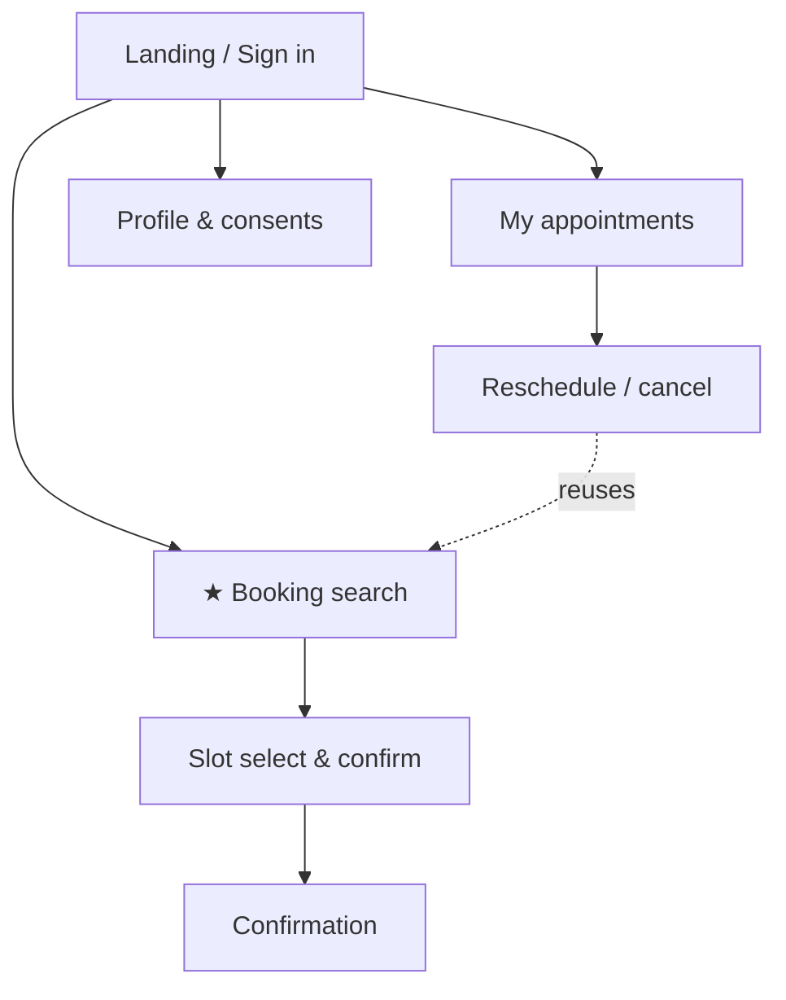

# UI Surfaces & Screen Inventory — Clinic Scheduling System

> **Status:** Screen inventory (complements Phases 1–7).
> **Depends on:** `01-requirements.md` (use cases, roles), `04-architecture.md` (frontend architecture), `05-openspec-workflow.md` (capabilities, build order).
> **Purpose:** consistency across changes + a per-screen briefing to feed Claude Design.
> **Document language:** English.

---

## Locked decisions

| ID | Decision | Choice |
|---|---|---|
| Z1 | App structure | **Two frontends, one repo:** public patient portal + internal staff back-office. Caddy routes by path. |
| Z2 | Visual depth | **Patient portal = designed showcase** (public, recruiter-facing). **Staff surfaces = functional, utilitarian** (tables, forms, app-shell). |

This is not visual design (no pixel-level wireframes) — it is the surface inventory, navigation, and per-screen intent. Each patient-portal entry doubles as a Claude Design brief.

---

## 1. Frontend structure

- **`apps/patient-portal`** — public, served at `/`. Patient authenticates via Google OIDC. Priority for design polish and accessibility (WCAG 2.1 AA; audience includes elderly users).
- **`apps/staff`** — internal, served at `/staff`. Authenticated app-shell (sidebar + top bar), role-conditioned navigation for Professional / Reception / Administrator. Utilitarian.
- Shared code (types, API client, i18n resources, UI primitives) in a common package. Both are React + TS + shadcn/ui + Tailwind + TanStack Query + react-i18next. Caddy serves each build and routes `/api` to the backend.

---

## 2. Patient portal — the showcase (public)

Navigation: Landing/Sign-in → { Booking flow · My appointments · Profile }. Reschedule reuses the booking search.

### Screen briefs

**P1 — Landing / Sign in** · route `/` · capability `identity-session`
Purpose: public entry; explain the clinic and start booking. Key elements: brief value line, "Sign in with Google" (patient), language switch (pt-BR/en). Clean, trustworthy, minimal.

**P2 — Booking search ★** · route `/book` · UC-1 · capabilities `availability`, `booking`
Purpose: the crown jewel — make the tri-constraint availability visible. Key elements: pick specialty; choose "specific professional" or "any professional of the specialty"; pick a date window; results show **only genuinely free slots** computed in real time (against professional working hours + external calendar + resource availability). Loading/empty/erro states matter here (real-time feel). This screen is the one to design with the most care.

**P3 — Slot select & confirm** · route `/book/confirm` · UC-1 · capability `booking`
Purpose: confirm the chosen slot and commit atomically. Key elements: slot summary (professional, time, type); first-time patients capture minimal data + **data-processing consent (LGPD)**; confirm button; graceful "slot just taken" message (optimistic booking → DB rejects the loser).

**P4 — Confirmation** · route `/book/success` · capability `booking`
Purpose: reassure the booking is done. Key elements: appointment summary, what to expect, link to "My appointments".

**P5 — My appointments** · route `/appointments` · UC-3 · capability `booking`
Purpose: the patient sees and manages **only their own** appointments (ownership authorization). Key elements: upcoming/past lists; per-appointment reschedule/cancel — **disabled inside the 24h cutoff** with a message to call reception.

**P6 — Reschedule / cancel** · route `/appointments/:id/reschedule` · UC-3 · capability `booking`
Purpose: change an existing appointment. Reuses P2's search scoped to the same appointment type; cancel releases slot + resource and propagates to the external calendar.

**P7 — Profile & consents** · route `/profile` · capability `identity-session`
Purpose: manage minimal personal data and consents (LGPD). Key elements: minimal PII, consent status/version, view-only note about data handling. Utilitarian even within the portal.

---

## 3. Staff back-office — functional (internal)

Shared **app-shell**: sidebar (role-conditioned), top bar (clinic name, user, language, sign out). Utilitarian tables and forms throughout.

**S0 — Staff sign in** · route `/staff/login` · capability `identity-session`
Professional signs in via Google OIDC; Reception/Admin via internal account.

### Professional (own schedule + the integration)

| Screen | Route | Purpose | Key elements | UC | Capability |
|---|---|---|---|---|---|
| **S1 — My schedule** | `/staff/schedule` | See own agenda | day/week view of appointments + blocks | UC-2 | booking |
| **S2 — Calendar connection** | `/staff/calendar` | Connect Google Calendar (the integration) | connect (OAuth consent), status, reconnect on revoke, last-sync info | UC-2 | calendar-integration |
| **S3 — Block time** | `/staff/blocks` | Create internal unavailability | create/edit `TimeBlock` (internal) | UC-2 | calendar-integration |

### Reception (day-to-day + conflict resolution)

| Screen | Route | Purpose | Key elements | UC | Capability |
|---|---|---|---|---|---|
| **S4 — Day view** | `/staff/day` | Run the day across professionals | today's appointments, quick actions | UC-3 | booking |
| **S5 — Book on behalf** | `/staff/book` | Phone/walk-in booking for a patient | booking flow (reuses availability); can act inside cutoff | UC-1, UC-3 | availability, booking |
| **S6 — Reconciliation queue** | `/staff/reconciliation` | Resolve external-block vs appointment conflicts (human-in-the-loop) | list of open `ReconciliationConflict`; resolve via cancel/reschedule | UC-2 | calendar-integration |

### Administrator (clinic configuration — UC-4)

| Screen | Route | Purpose | Capability |
|---|---|---|---|
| **S7 — Professionals** | `/staff/admin/professionals` | CRUD; assign specialties, working-hour templates, per-type durations | clinic-configuration |
| **S8 — Specialties** | `/staff/admin/specialties` | CRUD | clinic-configuration |
| **S9 — Resources & types** | `/staff/admin/resources` | CRUD resource types (+ buffer) and resources | clinic-configuration |
| **S10 — Appointment types** | `/staff/admin/appointment-types` | CRUD (specialty + required resource type) | clinic-configuration |
| **S11 — Users** | `/staff/admin/users` | Manage staff accounts | identity-session |

---

## 4. Screen → build-order change mapping

So each frontend change knows exactly which screens it delivers:

| Build-order change | Screens delivered |
|---|---|
| 2 · identity-session | P1, S0, P7, S11 |
| 3a · clinic-catalog | S8, S9, S10 |
| 3b · professional-configuration | S7 |
| 4 · availability-read | (feeds P2/S5; no standalone screen) |
| 5 · booking | P2, P3, P4, P5, P6, S1, S4, S5 |
| 6 · calendar-outbound | S2 |
| 7 · calendar-inbound | S3, S6 |
| 8 · reminders | (no screen; email) |

---

## 5. Using this with Claude Design

- Design the **patient portal first** (P1–P7), starting with **P2 (Booking search)** — it is the public, recruiter-facing showcase and the visual expression of the project's thesis.
- Each patient-portal brief above gives purpose + key elements + states; hand them to Claude Design one screen at a time for coherent, iterative results.
- Staff surfaces (S0–S11) can be generated as functional layouts from the app-shell + table/form patterns; they don't need bespoke visual design.

## 6. Out of scope (consistent with prior docs)

Occupancy/no-show **analytics reports** are fast-follow (outside MVP). Full LGPD data-subject-request workflows are out of scope (awareness only). No native mobile app — responsive web.